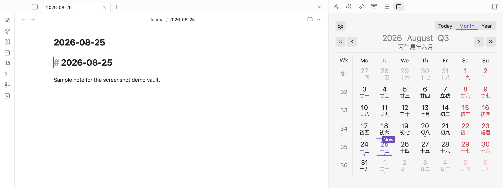
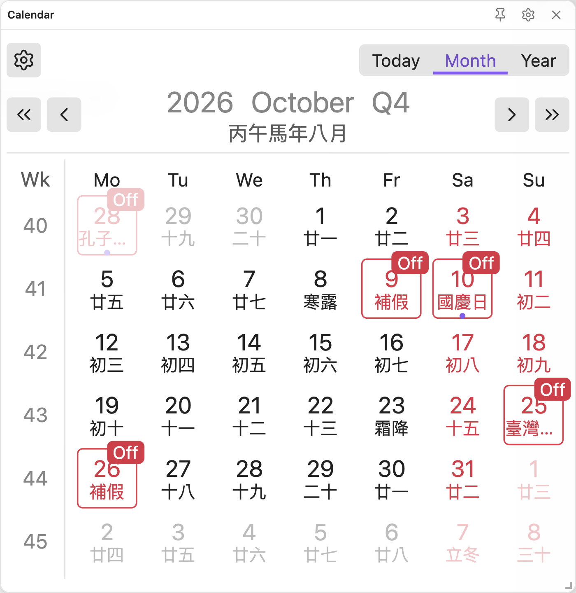
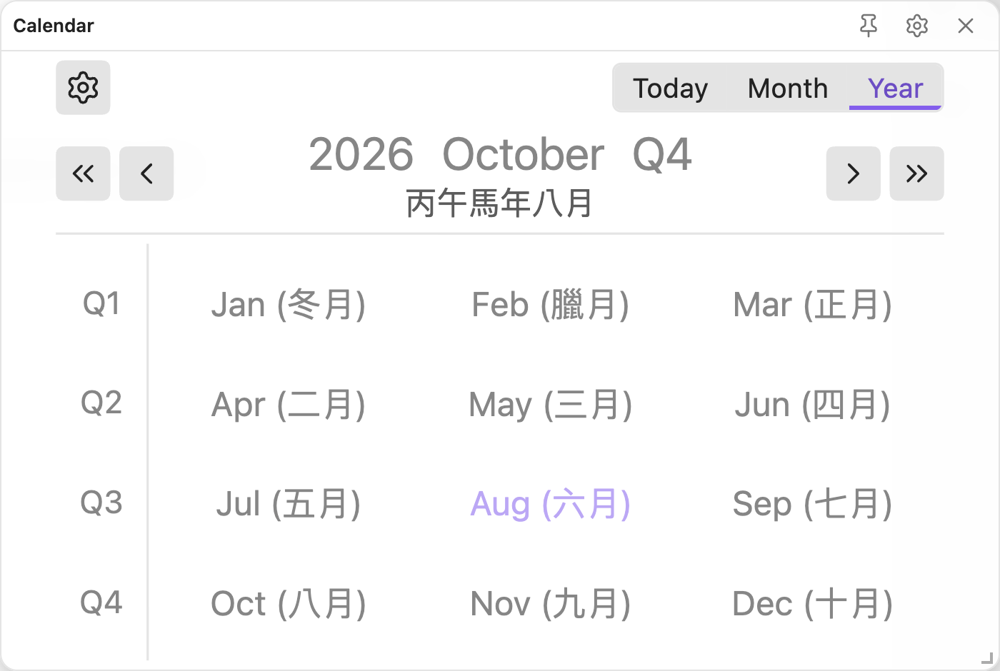
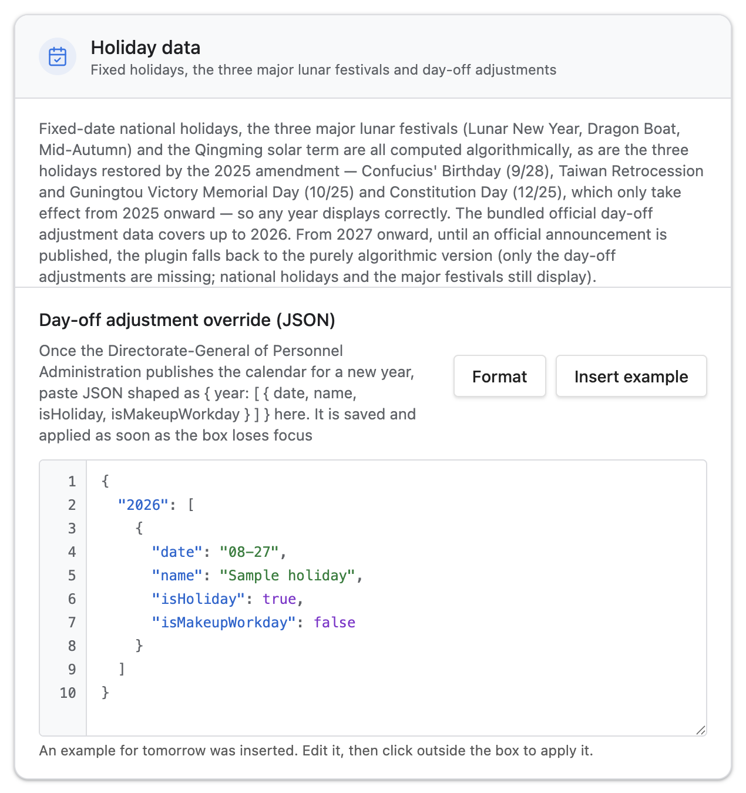

<h1 align="center">Open Taiwan Calendar</h1>

<p align="center">
<span>A Taiwanese almanac calendar for Obsidian: public holidays, substitute-day adjustments, the lunar calendar and the solar terms, with month/year view switching, a sidebar view and a draggable floating window. Pairs with QuickAdd to create daily, weekly, monthly, quarterly and yearly periodic notes.</span>
</p>

<p align="center">
English · <a href="./README.zh-TW.md">繁體中文</a>
</p>

<p align="center">

</p>

<p align="center">


</p>

## Features

- A month view showing the lunar date, the solar terms and Taiwanese festivals in every cell, and a year view showing all twelve months.
- Public holidays, substitute holidays and make-up workdays follow the calendar announced by the Directorate-General of Personnel Administration.
- A sidebar view and a floating window that can be dragged anywhere and resized; both scale themselves to fit their container.
- Every cell opens the periodic note for that day, week, month, quarter or year, and shows a dot when the note already exists.
- Your own events and reminders, stored in the daily notes themselves and marked on the calendar as a coloured dot in a row beside the "this day has a note" dot, never overlapping it.
- Reminders fire on a rule of your own — the day before and again on the day, say — through a dialog, a corner notice, a desktop notification, or any combination.
- The day's events are written into the top of the daily note, inside a comment-marked block that is rewritten without touching anything else in the file.
- A quick-add dialog that reads the date out of a plain sentence ("remind me on Saturday to take the laptop home"), and shows what it read so you can correct it before saving.
- Optional QuickAdd integration, plus template tokens for the lunar date, the solar term and the festival name.
- Dot size (small / medium / large) and hover preview are settings, alongside the normal / compact layout.
- Traditional Chinese and English interface, following the Obsidian display language.
- No network access whatsoever. The holiday table ships with the plugin, and a CI step fails the release if any network call site appears in the bundle.

## Requirements

Periodic notes come from either the core **Daily Notes** plugin or the community **Periodic Notes** plugin, so at least one of them has to be enabled. Weekly notes are also recognised from the **Calendar** plugin's settings. A granularity that no provider has enabled stays visible in the calendar but is not clickable, and says so on hover.

## Usage

- Open the calendar in the sidebar with the **Open sidebar** command, or toggle the floating window from the ribbon icon or the **Toggle floating calendar** command.
- Click a date to open its daily note, creating it first if it does not exist yet. The week numbers down the left edge, the quarters in the year view, and the year / month / quarter in the heading do the same for their own granularity.
- Ctrl-click (Cmd-click on macOS) opens the note in a new split.
- Right-click a cell for the note menu; hover over one to preview it, once "Open Taiwan Calendar" is enabled under Page Preview.
- Add an event with the **Add an event or reminder** command, the calendar icon in the toolbar, by right-clicking the day you want it on, or by selecting a line in a note and picking **Add a reminder** / **Add an event** from the editor menu — the selected text becomes the sentence.
- The dialog's dates start at the daily note you have open, if you have one, and each has a calendar button beside it. Moving the start date takes the end date with it, and the end can never fall before the start.
- **Show reminders and events** opens a list of everything you have entered, split into reminders and events, with what is running today at the top and what is finished greyed out at the bottom.
- The settings page carries the layout (normal or compact), the fading of past dates, the QuickAdd choices per granularity, an editor for the holiday data, the event and reminder options with the list of everything you have added, and a one-click setup that configures daily notes end to end.

## Events and Reminders

Entries live in the daily notes themselves. Adding one writes it into the `otc-events` property of every daily note its dates cover — creating those notes if they are not there — so a nine-day trip appears in all nine days. There is no side file and no database: the data syncs, versions and merges exactly like the rest of your notes, is editable by hand in Obsidian's property panel, and survives the plugin being uninstalled.

```yaml
---
date: 2026-08-29
otc-events:
  - id: da25b36f-cde1-427b-94b7-16d49a20a2b8
    title: Take the laptop home
    start: 2026-08-29
    end: 2026-08-29
    color: "#e07a5f"
    remindDaysBefore: [1, 0]
    remindTime: "09:00"
---
```

A reminder is a list of "days before" plus a time. `1, 0` fires once the day before and once on the day itself; `0` alone fires only on the day. A reminder whose time has already passed when Obsidian opens fires on opening rather than being skipped for the day. Which channels it uses — dialog, corner notice, desktop notification — is one setting for the whole vault rather than a field on every entry.

Reminders and events get separate default dot colours, so the two kinds of entry are told apart at a glance on the grid.

## Installation

Search for "Open Taiwan Calendar" under **Settings → Community plugins → Browse**.

To install it by hand, download `main.js`, `manifest.json` and `styles.css` from the [latest release](https://github.com/aione314159/open-taiwan-calendar/releases/latest) into `<vault>/.obsidian/plugins/open-taiwan-calendar/`, then reload Obsidian.

## Holiday Data Strategy

- **Fixed-date public holidays** (New Year's Day, Peace Memorial Day, Children's Day, Labour Day, National Day) and the **three major lunar festivals** (Lunar New Year, Dragon Boat Festival, Mid-Autumn Festival) plus the **Qingming solar term** (Tomb Sweeping Day) are computed algorithmically, so they display correctly for any year.
- **The three commemoration days made into holidays by the 2025 amendment** (Confucius' Birthday on 9/28, Taiwan Retrocession and Guningtou Victory Memorial Day on 10/25, Constitution Day on 12/25) are likewise computed algorithmically, and **only take effect from 2025 onwards** — years before the amendment are not retroactively marked as holidays.
- **Substitute-day adjustments** (the "make-up workdays" and "substitute holidays" announced each year by the Directorate-General of Personnel Administration) are built in for the years that already have an official announcement. Future years that are not yet covered fall back to the purely algorithmic version without substitute-day adjustments; once the official announcement is published, you can paste or update the JSON under "Holiday data" in the settings page to override it.

### Adding a new year's data yourself

Once the Directorate-General of Personnel Administration publishes the calendar for a new year, there is no need to wait for a plugin update — paste it in yourself and it takes effect straight away:

1. Open **Settings → Open Taiwan Calendar**
2. Find **Day-off adjustment override (JSON)** in the **Holiday data** section
3. Paste that year's JSON
4. **Click anywhere outside the editor** — it is saved and applied as soon as the box loses focus

<p align="center">

</p>

**Format** next to the editor re-indents the JSON; **Insert example** fills in one sample entry dated tomorrow, which you then edit into what you need.

The JSON maps a year to an array of every special date in it:

```json
{
  "2027": [
    { "date": "01-01", "name": "Founding Day",        "isHoliday": true,  "isMakeupWorkday": false },
    { "date": "02-06", "name": "Lunar New Year's Eve", "isHoliday": true,  "isMakeupWorkday": false },
    { "date": "02-20", "name": "Make-up workday",     "isHoliday": false, "isMakeupWorkday": true  },
    { "date": "04-05", "name": "Day off in lieu",     "isHoliday": true,  "isMakeupWorkday": false }
  ]
}
```

`date` is `MM-DD`, `isHoliday` marks a day off, and `isMakeupWorkday` marks a Saturday or Sunday that is worked. Malformed entries are dropped one by one, so a mostly-correct paste still applies.

## Attribution

Open Taiwan Calendar is an independent implementation with its own holiday engine, rendering and state handling, and no UI framework beyond React.

Lunar dates and solar terms are computed by [lunar-typescript](https://github.com/6tail/lunar-typescript); periodic notes are read and created through [obsidian-daily-notes-interface](https://github.com/liamcain/obsidian-daily-notes-interface).

## Development

```bash
npm install
npm run dev     # watch mode
npm run build   # type check + lint + emit main.js
```

## License

MIT — see [LICENSE](./LICENSE).
