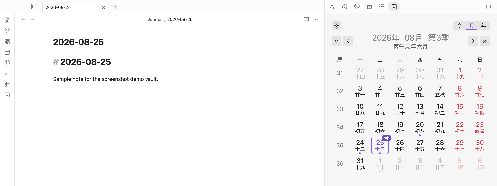
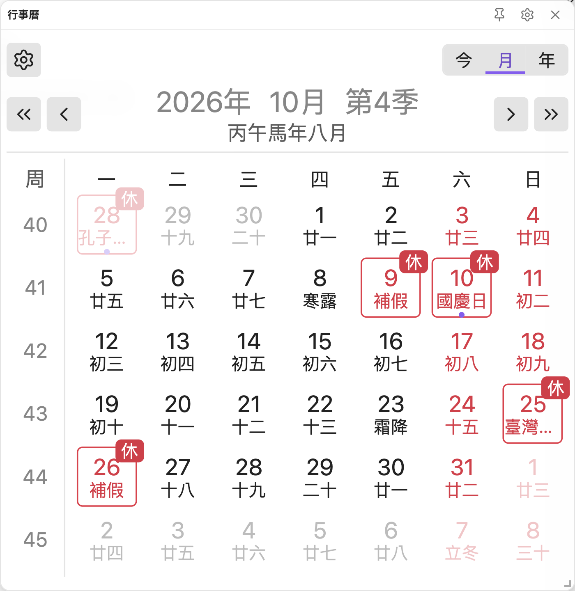
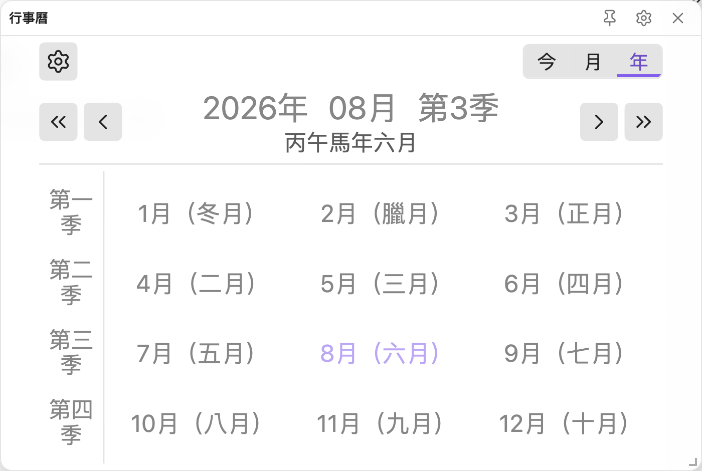
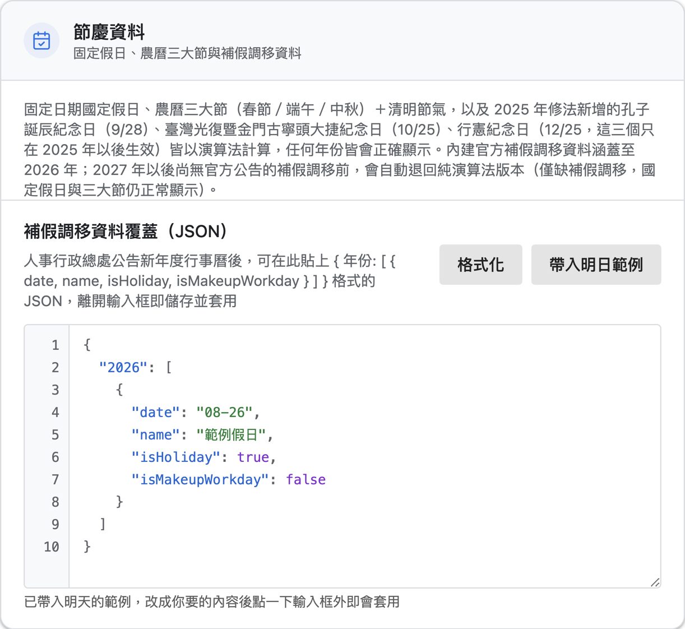

<h1 align="center">Open Taiwan Calendar</h1>

<p align="center">
<span>Obsidian 的台灣農民曆插件：國定假日、補班補假、農曆與二十四節氣，可切換月／年檢視，提供側邊欄與可拖曳的懸浮視窗，並能搭配 QuickAdd 建立日記、週記、月記、季記與年記。</span>
</p>

<p align="center">
<a href="./README.md">English</a> · 繁體中文
</p>

<p align="center">

</p>

<p align="center">


</p>

## 功能

- 月檢視的每一格顯示農曆日期、節氣與台灣節日；年檢視一次列出十二個月。
- 國定假日、補假與補行上班依行政院人事行政總處公告的辦公日曆表判定。
- 側邊欄檢視與懸浮視窗，懸浮視窗可任意拖曳與縮放，兩者都會自動縮放以貼合容器。
- 點任一格開啟該日／週／月／季／年的定期筆記，已存在的筆記會在格子下緣顯示圓點。
- 可選的 QuickAdd 整合，並提供農曆、節氣、節日名稱的範本變數。
- 介面隨 Obsidian 顯示語言在繁體中文與英文之間切換。
- 完全不連網。假日資料隨插件打包，CI 會掃描產出的 `main.js`，只要出現任何網路呼叫點就讓發布失敗。

## 前置需求

定期筆記由核心的 **每日筆記（Daily Notes）** 或社群插件 **Periodic Notes** 提供，至少要啟用其中一個。週記也認得 **Calendar** 插件的設定。沒有任何提供者啟用的粒度仍會顯示在日曆上，但不可點擊，滑鼠移上去會說明原因。

## 安裝

在 **設定 → 第三方插件 → 瀏覽** 搜尋「Open Taiwan Calendar」。

手動安裝則從 [最新發行版](https://github.com/aione314159/open-taiwan-calendar/releases/latest) 下載 `main.js`、`manifest.json`、`styles.css`，放進 `<你的庫>/.obsidian/plugins/open-taiwan-calendar/`，再重新載入 Obsidian。

## 介面說明

### 工具列（最上方一列）

| 元件 | 說明 |
|------|------|
| 齒輪圖示 | 直接開啟本插件的設定頁 |
| 今 | 跳回今天所在的月份，不改變目前是月檢視或年檢視 |
| 月 | 切換到月檢視（六週 × 七天的網格） |
| 年 | 切換到年檢視（十二個月格） |

### 導覽列（第二列）

| 元件 | 說明 |
|------|------|
| « | 上一年 |
| ‹ | 上一個月 |
| 年／月／季 標題 | 三段各自可點，分別開啟該年、該月、該季的定期筆記 |
| 標題下方的灰字 | 該日的干支年與農曆月，例如「丙午馬年七月」 |
| › | 下一個月 |
| » | 下一年 |

### 左側欄位

- **月檢視**：顯示「週」欄與該列的週數，點下去開啟該週的週記。
- **年檢視**：顯示四個季度，點下去開啟該季的季記。

### 日期格

每一格由三個部分組成：

1. **日期數字**
2. **第二行文字**：依序取「節日名稱 → 節氣 → 農曆日」，只顯示最優先的一項。名稱超過三個字會截斷並加上省略號，滑鼠移上去顯示全名。
3. **右上角標**：`今`（今天）、`休`（放假）、`班`（補行上班）。

格子的框線與顏色代表狀態：

| 外觀 | 意義 |
|------|------|
| 藍色框線、藍字 | 今天 |
| 紅色框線、紅字 | 國定假日或補假 |
| 深色框線 | 補行上班（雖然是週末仍要上班） |
| 紅字無框線 | 一般週末 |
| 淡化 | 不屬於當月，或是已經過去的日期（可在設定關閉） |
| 下緣圓點 | 該日已經有筆記 |

### 操作

| 操作 | 結果 |
|------|------|
| 點擊 | 開啟該格對應的定期筆記，不存在時先詢問再建立 |
| Ctrl／Cmd + 點擊 | 在新的分割窗格開啟 |
| 右鍵 | 開啟筆記選單（開啟、複製路徑等） |
| 滑鼠移上 | 顯示筆記預覽，需先在「頁面預覽」核心插件把 Open Taiwan Calendar 打開 |

## 台灣放假日期是怎麼決定的

這是本插件與其他農民曆插件最大的差別：**假日判定完全依據中華民國的辦公日曆表**，而不是其他地區的節假日規則。判定分成三層，由上往下覆蓋。

### 第一層：演算法計算（任何年份都正確）

以下假日不需要任何資料表，插件會直接算出來，所以查 2030 年或 1998 年都不會缺漏：

- **固定日期的國定假日**：開國紀念日（1/1）、和平紀念日（2/28）、兒童節（4/4）、勞動節（5/1）、國慶日（10/10）
- **三大農曆節日**：春節、端午節、中秋節
- **清明節**：依二十四節氣的清明推算，不是固定 4/5

### 第二層：2025 年修法恢復放假的三個紀念日

《紀念日及節日實施條例》於 2025 年將以下三個紀念日恢復為放假日，插件同樣以演算法處理，並且**只從 2025 年起生效**——2024 年以前不會被回溯標成假日：

- 孔子誕辰紀念日（9/28）
- 台灣光復暨古寧頭大捷紀念日（10/25）
- 行憲紀念日（12/25）

### 第三層：官方公告的補班補假（內建 2024–2026）

補假與補行上班沒有規則可循，每年由行政院人事行政總處另行公告。插件內建了**已公告年份**的完整資料（目前為 2024、2025、2026 年），資料來源為 [ruyut/TaiwanCalendar](https://github.com/ruyut/TaiwanCalendar)（整理自 data.gov.tw 開放資料）。

尚未公告的年份會自動退回第一、二層的演算法結果，也就是**國定假日正確，但沒有補假與補班調移**。

### 自己補上新年度的假日資料

等人事行政總處公告新年度日曆表之後，不必等插件更新，自己貼上就會生效：

1. 開啟 **設定 → Open Taiwan Calendar**
2. 找到 **節慶資料** 區塊的 **補假調移資料覆蓋（JSON）**
3. 貼上該年度的 JSON
4. **點一下編輯框以外的地方**（失焦即儲存並套用）

<p align="center">

</p>

編輯器旁的 **格式化** 會把 JSON 重新排版，**帶入明日範例** 會填入一筆以明天為日期的範例，改成你要的內容即可。

JSON 的結構是「年份對應到當年所有特殊日期的陣列」：

```json
{
  "2027": [
    { "date": "01-01", "name": "開國紀念日", "isHoliday": true,  "isMakeupWorkday": false },
    { "date": "02-06", "name": "農曆除夕",   "isHoliday": true,  "isMakeupWorkday": false },
    { "date": "02-20", "name": "補行上班",   "isHoliday": false, "isMakeupWorkday": true  },
    { "date": "04-05", "name": "補假",       "isHoliday": true,  "isMakeupWorkday": false }
  ]
}
```

| 欄位 | 型別 | 說明 |
|------|------|------|
| `date` | 字串 | 月日，格式固定為 `MM-DD`，要補零 |
| `name` | 字串 | 顯示在格子第二行的名稱，例如「補假」「補行上班」 |
| `isHoliday` | 布林 | `true` 代表放假，格子顯示紅色與「休」角標 |
| `isMakeupWorkday` | 布林 | `true` 代表補行上班，格子顯示深色框線與「班」角標 |

幾個要注意的地方：

- 覆寫是**整年替換**，不是逐筆合併。填了 `"2027"` 就代表這一年的特殊日期全部以你填的為準，內建資料在該年度不再套用。
- 想清掉填錯的資料，把整個內容換成 `{}` 再失焦即可。
- 格式錯誤或欄位缺漏的項目會被忽略，並在右上角以通知告訴你略過了幾筆，不會讓整個日曆掛掉。
- 節日名稱維持繁體中文原文（例如「補假」「補行上班」），因為它是政府日曆表的專有名詞，也是這份資料的比對依據，換成英文會對不上。

## 設定頁其他選項

| 設定 | 說明 |
|------|------|
| 版面 | 一般／精簡兩種尺寸，精簡版面適合較窄的側邊欄 |
| 過去日期淡化 | 把今天以前的日期調淡，仍然可以點擊開啟 |
| 懸浮視窗 | 開關、寬度；寬度改動會即時套用到已開啟的懸浮視窗 |
| QuickAdd | 各粒度可各自指定要走的 QuickAdd choice |
| 一鍵設定日記 | 檢查每日筆記的資料夾、格式與範本是否備齊，列出待辦後一次完成設定 |

## 範本變數

透過本插件建立**日記**時，範本裡的下列變數會被替換成當天的實際值。這些是農曆相關資料，只有日記會填入：

| 變數 | 內容 |
|------|------|
| `{{chineseYear}}` | 農曆年，例如「丙午年」 |
| `{{chineseMonth}}` | 農曆月 |
| `{{chineseDay}}` | 農曆日 |
| `{{ganzhi}}` | 干支 |
| `{{solarTerm}}` | 節氣，當天不是節氣時為空字串 |
| `{{festivals}}` | 節日名稱，沒有時為空字串 |
| `{{lunar}}` | 完整農曆字串 |
| `{{dateStr}}` | 檔名加節日名稱 |

沒有對應值的變數會被換成空字串，不會把 `{{solarTerm}}` 這種原文留在筆記裡。

走 QuickAdd 建立筆記時，除了上面這些，週記、月記、季記、年記還會多收到 `start`、`end`、`prevStart`、`prevEnd` 四個參數（該期間的起訖日期），由你的 QuickAdd choice 自行取用。這四個不走上面的範本替換。

## 開發

```bash
npm install
npm run dev     # 監看模式
npm run build   # 型別檢查 + lint + 產生 main.js
```

## 授權與致謝

MIT，見 [LICENSE](./LICENSE)。

Open Taiwan Calendar 是獨立實作，擁有自己的假日引擎、繪製邏輯與狀態管理，除了 React 之外不依賴任何 UI 框架。

農曆與節氣由 [lunar-typescript](https://github.com/6tail/lunar-typescript) 計算；定期筆記的讀取與建立透過 [obsidian-daily-notes-interface](https://github.com/liamcain/obsidian-daily-notes-interface)；假日資料整理自 [ruyut/TaiwanCalendar](https://github.com/ruyut/TaiwanCalendar)。
